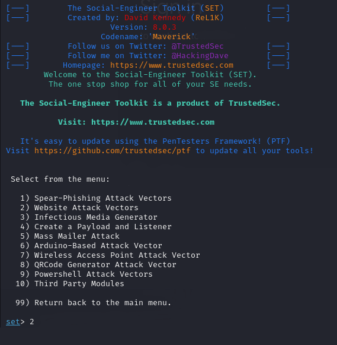
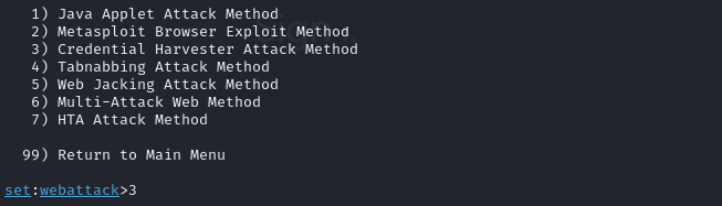
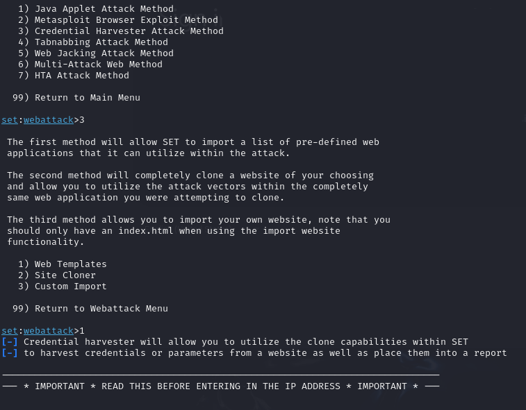
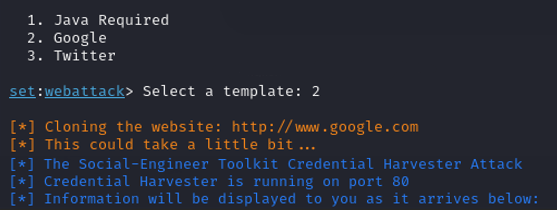
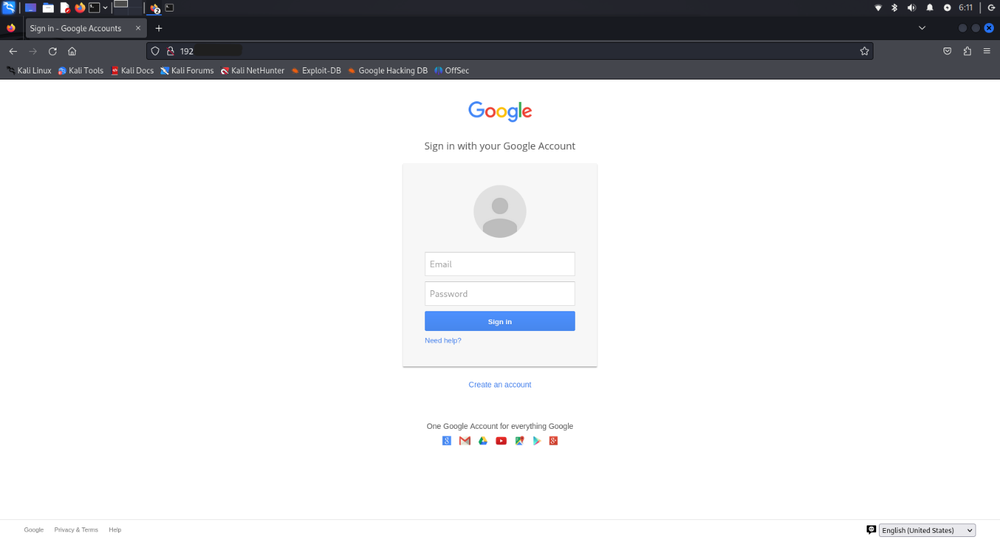
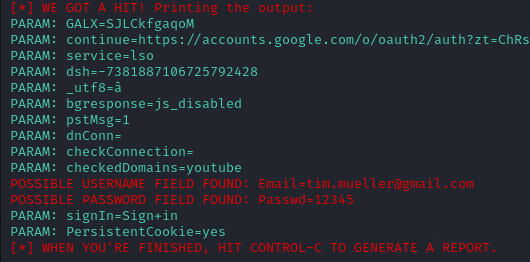

# Social-Engineering-Project
## Beschreibung
Dieses Projekt dokumentiert die Simulation eines Phishing-Angriffs unter Verwendung des Social Engineering Toolkits. Das primäre Ziel besteht darin, die Vorgehensweise eines Angreifers praxisnah zu simulieren und die damit verbundenen Risiken zu veranschaulichen. Basierend darauf sollen geeignete Gegenmaßnahmen zur Erkennung, Prävention und Sensibilisierung gegenüber Social-Engineering-Angriffen entwickelt werden.

**Der Fokus liegt hierbei auf:**
- Erstellung einer Phishing‑E-Mail
- Aufbau einer Fake‑Login‑Seite unter Zuhilfenahme des Social Engineering Toolkits
- Abgreifen von Zugangsdaten
- Analyse der Auswirkungen, sowie der Ableitung von Sicherheitsmaßnahmen

## Inhaltsverzeichnis
- [Vorbereitung](#vorbereitung)
- [Testumgebung](#testumgebung)
    - [E-Mail-Adressen](#e-mail-adressen)
    - [Python-Skript für den Mailversand](#python-skript-für-den-mailversand)
- [Durchführung](#durchführung)
- [Folgen](#folgen)
- [Maßnahmen](#maßnahmen)

## Vorbereitung
### Testumgebung
Für die Simulation wurde eine kontrollierte Umgebung eingerichtet mit:

    Hardware: Raspberry Pi 4
    Betriebssystem: Kali Linux
    Tools: Social Engineering Toolkit (SET) -> ist bereits auf Kali Linux vorinstalliert

### E-Mail-Adressen
**Angreifer‑Setup:**
- Erstellung eines Gmail‑Kontos mit einer temporären Telefonnummer
- Generierung eines App‑Passworts für den SMTP‑Zugriff
- Wahl eines vertrauenswürdigen Absendernamens (z. B. „Support Google“)

**Opfer-Setup:**
- ProtonMail‑Konto
      
### Python-Skript für den Mailversand
Für den Versand der E-Mail wurde ein Python-Skript erstellt, welches über den Gmail-SMTP-Server E-Mails versendet und einen HTML‑basierten Nachrichtentext enthält. 
Das Skript übernimmt folgende Aufgaben:
- Aufbau einer TLS‑gesicherten Verbindung zu smtp.gmail.com
- Authentifizierung über das zuvor erstellte App‑Passwort
- Erstellung einer MIME‑Nachricht mit HTML‑Inhalt
- Setzen eines vertrauenserweckenden Absendernamens („Support Google“)
- Versand der Phishing-Nachricht

## Durchführung
Für das Einrichten der Phishing-Seite wird das Social Engineering Toolkit verwendet. Nach dem Öffnen im Terminal erscheint diese Begrüßungsseite, bei der zuerst die zweite Option mit "Website Attack Vectors" ausgewählt wird: 

Anschließend bietet die dritte Option mit "Credential Harvester Attack Method" die Möglichkeit zur Erstellung der Phishing-Seite:

Nun existiert die Wahl zwischen Web Templates, Site Cloner und Custom Import. Weil Google schon als Template vordefiniert ist, fällt die Wahl auf 1:

Jetzt kann Google ausgewählt werden:

Kali Linux startet daraufhin den Webserver auf Port 80, wodurch die gefälschte Seite nun unter unserer IP-Adresse zu finden ist. In der Realität nutzen Angreifer dafür Domains, die der originalen Website ähnlich sind. Mit dem Tool dnstwist lassen sich solche Domänennamen einfach finden. Zudem zeigt es an, welche davon bereits in Verwendung sind und welche noch verfügbar wären. In dem bereits erstellten HTML-Skript wird der Link zu der Domäne hinter dem Button „Jetzt anmelden“ versteckt. Sobald das Programm ausgeführt wird, wird die E-Mail versendet.

Im Posteingang der Zielperson erscheint die Phishing-E-Mail wie folgt:

Wird die E-Mail geöffnet, erscheint eine dringlich formulierte Nachricht mit folgendem Inhalt:

Da die E-Mail auf den ersten Blick vertrauenswürdig wirkt und die Zielperson ihr Konto überprüfen möchte, klickt sie auf den Button und gelangt auf folgende Webseite:

Wenn das Opfer die Anmeldedaten eingibt und sich anmeldet, werden diese von dem Social Engineering Toolkit abgegriffen:

Jetzt ist es dem Angreifer möglich, sich in Gmail anzumelden, sofern keine 2FA aktiviert wurde. Wobei hier erwähnenswert ist, dass es heutzutage auch Tools wie Evilginx2 gibt, die diesen erweiterten Sicherheitsmechanismus umgehen können.

## Folgen
Phishing-Angriffe können erhebliche Folgen für die Opfer haben. Im vorliegenden Beispiel führt der Angriff insbesondere zu Identitätsdiebstahl und dem Missbrauch personenbezogener Daten. Da E-Mail-Konten häufig mit zahlreichen weiteren Diensten verknüpft sind, können Angreifer durch das Zurücksetzen von Passwörtern auch Zugriff auf soziale Netzwerke, Online-Shops oder Finanzkonten erlangen. Darüber hinaus können die erlangten Daten zur Erstellung betrügerischer Konten oder für weitere Straftaten genutzt werden.

Weitere mögliche Folgen sind:
- finanzielle Verluste
- Rufschädigung
- psychische Belastungen 
- Datenschutzverletzungen 
- Ausfälle und Störungen
