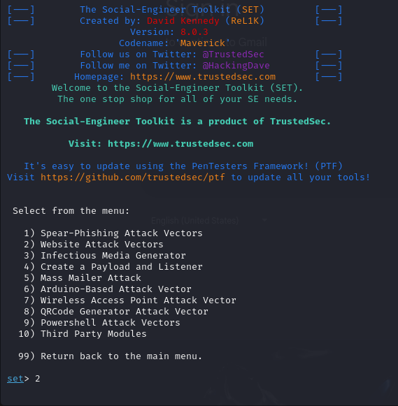

# Social-Engineering-Project
## Beschreibung
Dieses Projekt dokumentiert die Simulation eines Phishing-Angriffs unter Verwendung des Social Engineering Toolkits. Das primäre Ziel besteht darin, die Vorgehensweise eines Angreifers praxisnah zu simulieren und die damit verbundenen Risiken zu veranschaulichen. Basierend darauf sollen geeignete Gegenmaßnahmen zur Erkennung, Prävention und Sensibilisierung gegenüber Social-Engineering-Angriffen entwickelt werden.

**Der Fokus liegt hierbei auf:**
- Erstellung einer Phishing‑E-Mail
- Aufbau einer Fake‑Login‑Seite unter Zuhilfenahme des Social Engineering Toolkits
- Abgreifen von Zugangsdaten
- Analyse der Auswirkungen, sowie der Ableitung von Sicherheitsmaßnahmen

## Vorbereitung
### Testumgebung
Für die Simulation wurde eine kontrollierte Umgebung eingerichtet mit:

    Hardware: Raspberry Pi 4
    Betriebssystem: Kali Linux
    Tools: Social Engineering Toolkit (SET) -> ist bereits auf Kali Linux vorinstalliert

### E-Mail-Adressen
**Angreifer‑Setup:**
- Erstellung eines Gmail‑Kontos mit einer temporären Telefonnummer
- Generierung eines App‑Passworts für den SMTP‑Zugriff
- Wahl eines vertrauenswürdigen Absendernamens (z. B. „Support Google“)

**Opfer-Setup:**
- ProtonMail‑Konto
      
### Python Skript für den E-Mail-Versand
Für den Versand der E-Mail wurde ein Python-Skript erstellt, welches über den Gmail-SMTP-Server E-Mails versendet und einen HTML‑basierten Nachrichtentext enthält. 
Das Skript übernimmt folgende Aufgaben:
- Aufbau einer TLS‑gesicherten Verbindung zu smtp.gmail.com
- Authentifizierung über das zuvor erstellte App‑Passwort
- Erstellung einer MIME‑Nachricht mit HTML‑Inhalt
- Setzen eines vertrauenserweckenden Absendernamens („Support Google“)
- Versand der Phishing-Nachricht

## Durchführung
Für das Einrichten der Phishing-Seite wird das Social Engineering Toolkit verwendet. Nach dem Öffnen im Terminal erscheint diese Begrüßungsseite: 

